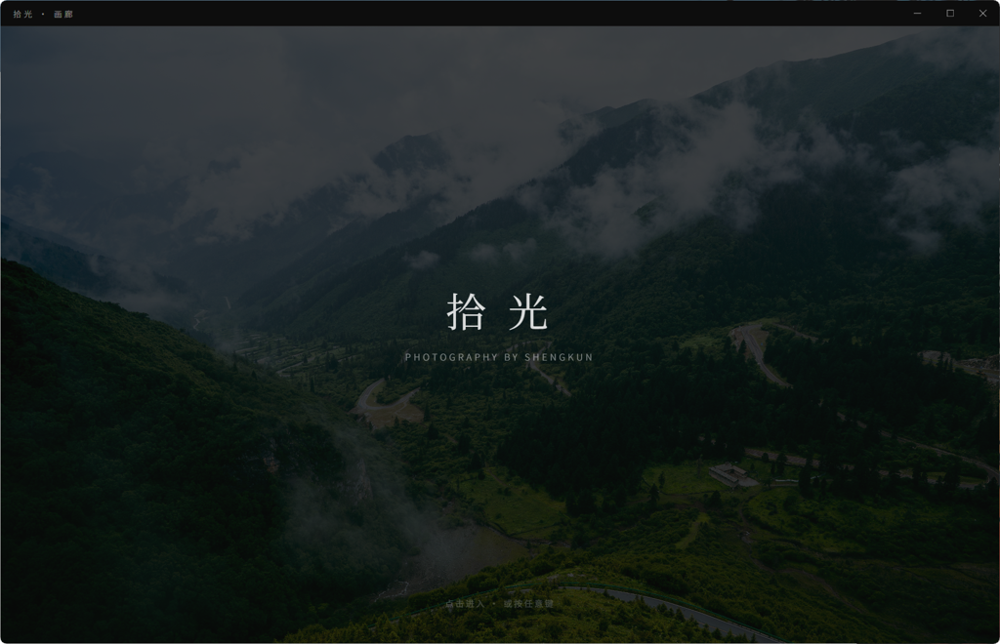
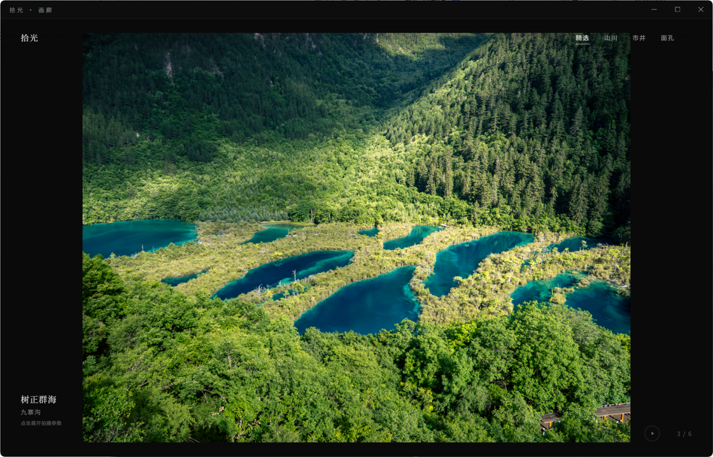
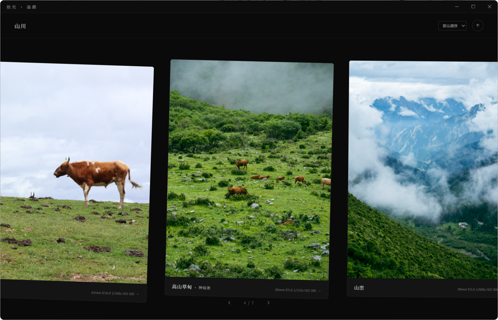
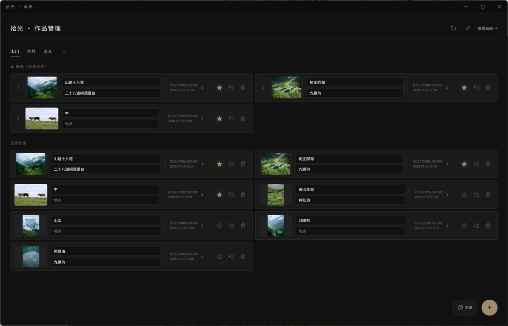

<div align="center">

# 拾光 · 画廊

**一座装进桌面的私人影像展馆**

*只为照片本身而生 · 稳重克制的展览美学 · Windows / macOS 开箱即用*

**ShiGuang Gallery** — a local-first photography exhibition app for Windows & macOS.<br>
Elegant full-screen slideshow, EXIF display & digital signage, built with Tauri + Rust.

[](https://github.com/Pi-SK/shiguang-gallery/releases)
[](LICENSE)


</div>

---

## 缘起

照片不该被埋没在文件夹的层层缩略图里。

「拾光 · 画廊」为你的摄影作品提供一个正式的展出之所——它以展览的礼仪对待每一幅作品：深色的展墙、克制的排版、悄然退场的界面元素，让光影成为唯一的主角。

它的设计语言内敛而稳重：不喧宾，不夺主，只在恰当的时刻以恰当的分寸出现，与照片之美相互映衬。无论是自用的数字影集，还是画廊、艺术馆、展览现场循环播放的电子水牌，它都能安静而体面地胜任。

## 一览

<div align="center">

*开屏落款——署上你的名字，一幅作品静待入场*



*沉浸幻灯片——全屏展示精选，界面元素静置自隐*



*卡片长廊——横向铺陈系列全貌，一览无余*



*作品管理——拖拽导入、标记精选、编排系列*



</div>

## 特性

### 观展体验

- **扉页落款** —— 开屏如展册扉页，署上你的名字，随机一幅作品作封面
- **沉浸幻灯片** —— 全屏展示精选作品，切换如呼吸般轻缓；界面元素静置时自行隐去
- **自动轮播** —— 一键开启，作品按节奏徐徐更迭，适合展场无人值守播放
- **系列策展** —— 按主题组织作品系列，顶部导航如展厅分区，一步即达
- **卡片长廊** —— 向下一步进入横向卡片墙，纵览系列全貌，支持多种排序
- **拍摄参数** —— EXIF 信息（机身、镜头、光圈、快门、感光度……）默认收敛，轻点展开

### 作品管理

- **拖拽入馆** —— 拖入照片即完成导入，自动解析 EXIF 与拍摄时间，自动生成缩略图
- **精选与排序** —— 标记精选、拖拽排序，决定作品的登台顺序
- **系列管理** —— 自由创建、重命名、编排作品系列
- **相似去重** —— 内置查重工具，找出重复与近似的照片，保持馆藏干净
- **本地存放** —— 所有照片与数据都保存在你自选的本地目录，无账号、无云端、无网络依赖

## 适用场景

| 场景 | 用法 |
| --- | --- |
| 个人影像馆 | 日常整理与回味自己的摄影作品 |
| 展览电子水牌 | 连接大屏 / 竖屏，开启自动轮播即成循环播放的电子展牌 |
| 作品集演示 | 面对面向客户、友人展示作品，全屏无干扰 |

## 安装

前往本仓库的 [**Releases**](https://github.com/Pi-SK/shiguang-gallery/releases) 页面，下载最新的安装包：

| 平台 | 安装包 |
|------|--------|
| Windows | `ShiGuang-Gallery_2.1.0_x64-setup.exe` |
| macOS | `ShiGuang-Gallery_2.1.0_aarch64.dmg` (Apple Silicon) / `ShiGuang-Gallery_2.1.0_x64.dmg` (Intel) |

双击安装即可。首次启动时选择（或新建）你的照片库目录，也可以先载入内置示例作品集感受一番。

> **macOS 用户注意**：未签名的 .dmg 首次打开会被 Gatekeeper 拦截，请右键 → 打开，或在终端执行 `xattr -cr /Applications/拾光·画廊.app` 清除隔离属性。

## 从源码构建

依赖：[Rust 工具链](https://rustup.rs/)（stable）与 Node.js（用于 Tauri CLI）。

```powershell
# 开发调试（debug 构建）
cargo build --manifest-path src-tauri/Cargo.toml
./src-tauri/target/debug/photo-gallery.exe    # Windows
./src-tauri/target/debug/photo-gallery        # macOS

# 打包发布（按当前平台自动产出默认安装包）
npx --yes @tauri-apps/cli@latest build
```

| 平台 | 产物路径 |
|------|----------|
| Windows | `src-tauri/target/release/bundle/nsis/` (NSIS 安装包) |
| macOS | `src-tauri/target/release/bundle/dmg/` (.dmg) |

## 技术剪影

- **外壳**：[Tauri 2](https://tauri.app/) —— 轻量桌面框架，安装包仅数 MB
- **后端**：Rust —— 照片导入、EXIF 解析、缩略图生成、查重比对，全部本地完成
- **前端**：原生 HTML / CSS / JavaScript，零框架、零构建链，界面即代码
- **数据**：JSON 文件 + 原图文件，明文存于照片库目录，随时可迁移、可备份

```
photo_gallery/
├── frontend/            # 展示页 / 管理页 / 去重页（原生三件套）
│   ├── gallery.html     #   画廊展示
│   ├── admin.html       #   作品管理
│   └── dedup.html       #   相似照片去重
└── src-tauri/           # Rust 后端与打包配置
    └── src/             #   命令、存储、EXIF、缩略图……
```

## 许可

本项目基于 [MIT License](LICENSE) 开源。

---

<div align="center">

*愿每一次快门定格的光，都有一面值得的墙。*

</div>
